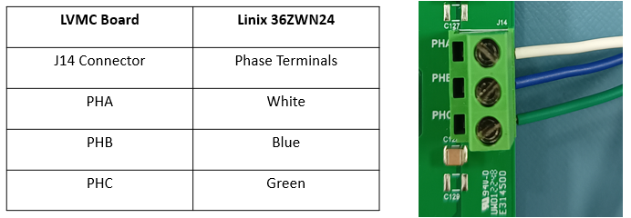
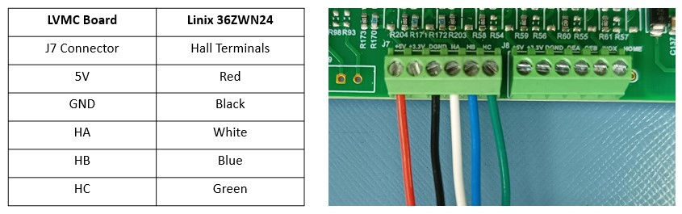
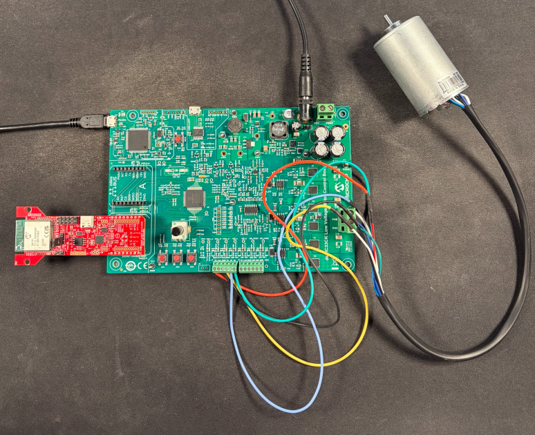
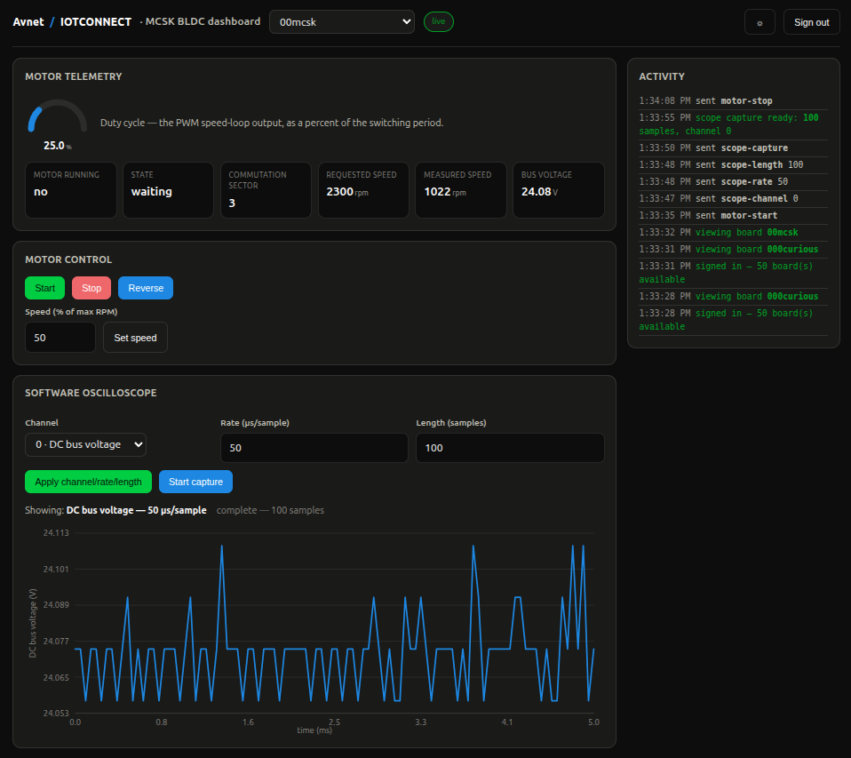

# dsPIC33CK256MP508 Motor Control Starter Kit + RNWF11 /IOTCONNECT Quickstart

A baremetal C quickstart connecting the Microchip **dsPIC33CK256MP508** (on
the **dsPIC33CK Motor Control Starter Kit**, running Microchip's AN957 BLDC
motor-control reference application - see
[`docs/AN957 Demo ReadMe MCSK.pdf`](firmware/dspic33ck256mp508_rnwf11_iotconnect.X/docs))
to [Avnet /IOTCONNECT](https://www.iotconnect.io/) using /IOTCONNECT's
[C SDK](https://github.com/avnet-iotconnect/iotc-c-lib), over the Microchip
**RNWF11 UART to Cloud Add-on Board**. No RTOS, no MQTT/TLS stack on the
MCU - the RNWF11 owns the WiFi/MQTT/TLS connection itself, using a
certificate and key stored on its own filesystem, and the dsPIC33 just
talks to it over UART with AT commands. While the motor control loop runs
in real time, the demo publishes live motor telemetry (run state, speed,
current, duty cycle, etc.) to /IOTCONNECT every 10 seconds.


## Table of Contents

1. [Prerequisites](#1-prerequisites)
2. [Get the Quickstart Source](#2-get-the-quickstart-source)
3. [Cloud Account Setup](#3-cloud-account-setup)
4. [Import the Device Template](#4-import-the-device-template)
5. [Generate and Upload the Device Certificate](#5-generate-and-upload-the-device-certificate)
6. [Create the Device in /IOTCONNECT](#6-create-the-device-in-iotconnect)
7. [Mount the RNWF11 on the Starter Kit](#7-mount-the-rnwf11-on-the-starter-kit)
8. [Connect the Motor](#8-connect-the-motor)
9. [Configure the Firmware](#9-configure-the-firmware)
10. [Build the Firmware](#10-build-the-firmware)
11. [Flash and Run the Demo](#11-flash-and-run-the-demo)
12. [Resources](#12-resources)

## 1. Prerequisites

### Hardware

1. [dsPIC33CK Motor Control Starter Kit](https://www.microchip.com/en-us/development-tool/EV12F76A)

2. [RNWF11 UART to Cloud Add-on Board (EV12H55A)](https://www.microchip.com/en-us/development-tool/ev12h55a)
3. 1 micro-USB cable
4. 1 USB-C cable
5. A 2.4 GHz WiFi network

### Software

1. [MPLAB X IDE](https://www.microchip.com/mplabx) 6.25 or later, with the **XC-DSC** compiler (4.00 or later) and the `dsPIC33CK-MP_DFP` device pack - required to build the firmware
2. `openssl` on your `PATH` (already present on most Linux systems; on Windows it's included with [Git for Windows](https://git-scm.com/downloads/win), among other sources)
3. Either Python 3.9+ **or** PowerShell 5.1+ (Windows ships this by default; PowerShell 7+ also works on Linux) to run the provisioning scripts - pick whichever you're more comfortable with, both do the same thing
4. A serial terminal (PuTTY, Tera Term, MPLAB Data Visualizer's terminal, etc.) to watch the device's console output
5. An [/IOTCONNECT](https://www.iotconnect.io/) account

> [!NOTE]
> This project pins `dsPIC33CK-MP_DFP` 1.15.423 in
> `firmware/dspic33ck256mp508_rnwf11_iotconnect.X/bldc.X/nbproject/configurations.xml`.
> If your installed pack is a different version, MPLAB X will prompt to
> resolve it on first open - accepting the update (or editing that pinned
> version to match what you have installed) is normally enough.

## 2. Get the Quickstart Source

This firmware has to be built from source, so clone the repository:

```bash
git clone https://github.com/avnet-iotconnect/iotc-mchp-dspic33ck-lvmcb.git
cd iotc-mchp-dspic33ck-lvmcb
git submodule update --init --recursive
```

See [tools/](tools/) for the provisioning scripts you'll use in the next few steps.

## 3. Cloud Account Setup

An /IOTCONNECT account with an **AWS backend** is required. If you need to create an account, a
**free trial subscription** is available — no credit card required:

- Sign
  up: [https://subscription.iotconnect.io/subscribe?cloud=aws](https://subscription.iotconnect.io/subscribe?cloud=aws)
  (see
  the [AWS Marketplace option](https://github.com/avnet-iotconnect/avnet-iotconnect.github.io/blob/main/documentation/iotconnect/subscription/iotconnect_aws_marketplace.md)
  if you prefer)
- Log in: [https://console.iotconnect.io/login](https://console.iotconnect.io/login)

> [!NOTE]
> Be sure to check your SPAM folder for the temporary password after registering if you don't see
> it after a couple of minutes.

## 4. Import the Device Template

This demo publishes live motor telemetry and accepts motor control commands -
import [`templates/dspic33MC-template.json`](templates/dspic33MC-template.json).

1. Log in at [console.iotconnect.io](https://console.iotconnect.io).
2. Open the **Device** module:

   

3. At the bottom of the page, click **Templates**:

   

4. Click **Create Template**:

   

5. Click **Import**, and select
   [`templates/dspic33MC-template.json`](templates/dspic33MC-template.json)
   from the repo you cloned in Step 2:

   

## 5. Generate and Upload the Device Certificate

The RNWF11 board has its own USB-C port and power-select jumper
(`PC3V3` / `HOST3V3`), independent of the starter kit - this step uses it
standalone, **not** mounted on the starter kit yet.

Move the jumper to **PC3V3** and plug the RNWF11's USB-C port directly into
your PC.

<table>
  <tr>
    <td align="center"><br><b>PC3V3</b> - flashing/provisioning (this step)</td>
    <td align="center"><br><b>HOST3V3</b> - normal operation (Step 7)</td>
  </tr>
</table>

**Before running the command below**, find the serial port name it just
enumerated as - **the full path/name, not just the last part** (e.g.
`/dev/ttyACM0`, not `ttyACM0`):
- **Linux**: run `ls /dev/serial/by-id/` (or `dmesg | tail` right after
  plugging it in) - look for the RNWF11's MCP2200 USB-to-UART bridge, e.g.
  `/dev/ttyACM0`.
- **Windows**: open Device Manager &rarr; **Ports (COM & LPT)** - look for
  "MCP2200 USB Serial Port Emulator" and note its `COMx` number (e.g. `COM6`).

This board's firmware expects the default filenames on the RNWF11's own
filesystem (`root-ca` / `device-cert` / `device-key`, set in
`iotconnect/iotconnect_rnwf11_config.h`), so the `--ca-name`/`--cert-name`/
`--key-name` flags can stay at their defaults.

From the `iotc-mchp-dspic33ck-lvmcb` directory you cloned:

**Linux:**
```bash
cd tools
curl -fsSLO https://www.amazontrust.com/repository/AmazonRootCA1.pem
```

Replace `MYPORTNAME` with the port you found above, and `MYUNIQUEID` with a
Unique ID of your own choosing for this device - pick something memorable,
e.g. `my-desk-dspic33ck`. You'll reuse whatever you pick later, both when
creating the device in /IOTCONNECT and when resolving connection info.
```bash
python3 provision_rnwf11_cert.py --port MYPORTNAME --duid MYUNIQUEID --ca-cert-path AmazonRootCA1.pem
```
```bash
cd ..
```

**Windows (PowerShell):**
```powershell
Set-Location tools
Invoke-WebRequest https://www.amazontrust.com/repository/AmazonRootCA1.pem -OutFile AmazonRootCA1.pem
```

Replace `MYPORTNAME` with the port you found above, and `MYUNIQUEID` with a
Unique ID of your own choosing for this device - pick something memorable,
e.g. `my-desk-dspic33ck`. You'll reuse whatever you pick later, both when
creating the device in /IOTCONNECT and when resolving connection info.
```powershell
.\provision_rnwf11_cert.ps1 -Port MYPORTNAME -Duid MYUNIQUEID -CaCertPath AmazonRootCA1.pem
```
```powershell
Set-Location ..
```

This generates a self-signed device certificate, prints it to the terminal,
and uploads the CA cert, device cert, and device key to the RNWF11's own
filesystem via `AT+FS`. You'll paste the printed device certificate into the 
/IOTCONNECT console in the next step.

> [!NOTE]
> This can take up to 60 seconds to finish depending on your host PC environment.

## 6. Create the Device in /IOTCONNECT

1. After logging into your /IOTCONNECT account on
   [console.iotconnect.io](https://console.iotconnect.io), go to the
   **Device** page and click **Create Device**:

   

2. Set the Unique ID and Device Name:

   

   - **Unique ID**: must be the **exact same** `MYUNIQUEID` value you passed
     to `provision_rnwf11_cert.py`/`.ps1` earlier - this is the DUID and
     it's what ties everything together.
   - **Device Name**: a separate display name shown in the
     /IOTCONNECT console with looser character constraints (e.g. can use spaces)

3. Select your **Entity**:

   

4. Select the template you imported earlier in
   [Step 4](#4-import-the-device-template):

   

5. Under **Device certificate**, choose **Use my certificate**, and paste
   the certificate PEM that `provision_rnwf11_cert.py`/`.ps1` printed:

   

6. Click **Save & View**.

## 7. Mount the RNWF11 on the Starter Kit

Move the RNWF11's power jumper back to **HOST3V3**.

> [!IMPORTANT]
> The RNWF11 goes in **mikroBUS/Click socket B**, not A. Per
> `iotconnect/iotconnect_rnwf11_config.h`: *"UART2 is routed to the mikroBUS
> B header, where the RNWF11 is seated."*


## 8. Connect the Motor

With the board unpowered, connect the included motor's wires to the board's
two green terminal blocks following the pinout below from
Microchip's [AN957 Demo ReadMe MCSK.pdf](firmware/dspic33ck256mp508_rnwf11_iotconnect.X/docs).

1. Connect the 3 thick phase wires to connector **J14**:

   | J14 terminal | Wire color |
   |---|---|
   | PHA | White |
   | PHB | Blue |
   | PHC | Green |

   

2. Connect the 5 thin Hall sensor wires to connector **J7**:

   | J7 terminal | Wire color |
   |---|---|
   | 5V | Red |
   | GND | Black |
   | HA | White |
   | HB | Blue |
   | HC | Green |

   

> [!NOTE]
> The motor's wires may not all comfortably reach their terminals depending
> on how your board and motor are positioned so you may need to solder on
> extensions for some of them.

## 9. Configure the Firmware

`provision_device_config.py`/`.ps1` resolves your device's /IOTCONNECT MQTT
connection info via /IOTCONNECT's discovery/identity API, then writes it -
along with your WiFi credentials - directly into
[`iotconnect/iotconnect_rnwf11_config.h`](firmware/dspic33ck256mp508_rnwf11_iotconnect.X/iotconnect/iotconnect_rnwf11_config.h)
so it's compiled into the firmware. It finds that file on its own, relative
to its own location, so there's nothing to copy-paste by hand.

**Linux:**
```bash
cd tools
```

Replace `MYSSID`/`MYPASSWORD` with your real WiFi credentials,
`MYCPID`/`MYENVIRONMENT` with the values under **Settings &rarr; Key
Vault** in the /IOTCONNECT console, and `MYUNIQUEID` with the same Unique ID
you used in Steps 4 and 5:
```bash
python3 provision_device_config.py --wifi-ssid MYSSID --wifi-password MYPASSWORD --cpid MYCPID --env MYENVIRONMENT --duid MYUNIQUEID
```
```bash
cd ..
```

**Windows (PowerShell):**
```powershell
Set-Location tools
```

Replace `MYSSID`/`MYPASSWORD` with your real WiFi credentials,
`MYCPID`/`MYENVIRONMENT` with the values under **Settings &rarr; Key
Vault** in the /IOTCONNECT console, and `MYUNIQUEID` with the same Unique ID
you used in Steps 4 and 5:
```powershell
.\provision_device_config.ps1 -WifiSsid MYSSID -WifiPassword MYPASSWORD -Cpid MYCPID -Env MYENVIRONMENT -Duid MYUNIQUEID
```
```powershell
Set-Location ..
```

> [!NOTE]
> Pass `--port`/`-Port` (e.g. `--port /dev/ttyACM0` or `-Port COM5`) to
> *also* push this same config live, over serial, into an already-flashed,
> already-running board's on-chip flash - useful for reconfiguring a board
> without rebuilding. It's optional; omit it and the script only updates the
> header file above.

## 10. Build the Firmware

In MPLAB X:

1. Open [`firmware/dspic33ck256mp508_rnwf11_iotconnect.X/bldc.X`](firmware/dspic33ck256mp508_rnwf11_iotconnect.X/bldc.X).
2. Clean and Build. The output `.hex` lands in
   `bldc.X/dist/default/production/`.

## 11. Flash and Run the Demo

Connect the board's power supply, and connect the included micro-USB cable
between your PC and the board's **PKOB4** port. The RNWF11 stays mounted
from Step 7.



Program the board via the onboard debugger (**Make and Program Device** in
MPLAB X).

To watch the boot log, open a serial terminal at 115200 8-N-1.

> [!NOTE]
> The micro-USB connection can stay on the PKOB4 port on the board for connecting to the 
> serial console. The firmware routes the serial communications through this port to 
> prevent users from needing to swap their USB connection between ports on the board.

Once connected, the firmware publishes live motor telemetry to /IOTCONNECT
every 10 seconds:

```json
{"run": 1, "st": 3, "sec": 4, "rpm": 2300, "spd": 2287, "ic": 0, "im": 12, "duty": 9821, "vdc": 15234}
```

(`run` = motor running, `st` = state machine state, `sec` = commutation
sector, `rpm`/`spd` = requested/measured speed, `ic`/`im` = requested/measured
current, `duty` = PWM duty cycle, `vdc` = DC bus voltage ADC reading - multiply by
0.002176 for volts, e.g. 11064 is about 24.1 V.) You can watch it
arrive on the device's **Live Data** tab in the /IOTCONNECT console, but the
web dashboard below is the recommended way to see it.

### Using the Web Dashboard



You can use this AWS-hosted dashboard to view telemetry live, send motor/oscilloscope
commands, and plot scope capture as a charts. Open
[the dashboard](https://7qh4y68kpa.execute-api.us-east-1.amazonaws.com) and
sign in with your own /IOTCONNECT solution key, environment, email, and
password (each person uses their own /IOTCONNECT login - nothing is shared or
stored beyond your signed-in session).

From there:
- The **telemetry** panel shows the fields above, live, updating every few
  seconds.
- The **motor control** panel sends `motor-start`/`stop`/`reverse`/`speed` -
  see the table below for what each does.
- The **oscilloscope** panel sets the channel/rate/length (see below for what
  they mean and good starting values), triggers a capture, and plots the
  result as soon as it's done publishing - no copying chunk lines anywhere.

> [!NOTE]
> This dashboard is already deployed and hosted. You don't need an AWS account
> or any setup to use it.

The current oscilloscope settings publish as their own small message, on the
same 10-second cadence, right after the message above:

```json
{"osc_ch": 0, "osc_rate": 500, "osc_len": 50}
```

They're deliberately a separate publish rather than merged into the message
above - see [Software Oscilloscope](#software-oscilloscope) below for why.

### Motor Control Commands

The motor behavior is primarily driven by /IOTCONNECT C2D commands - sent from
the dashboard's buttons, or from the /IOTCONNECT console directly - but **SW1**
on the board itself can be used to toggle the motor power manually. SW1 is handled 
in the motor control interrupt, so it responds immediately whatever else the firmware 
is doing.

Commands that arrive while a scope capture is being published are queued (up to 4)
and run, in order, once the capture has finished, so they can't disturb the capture.
The exception is `motor-stop`, which stops the motor the moment it is received; its
acknowledgement is sent later with the rest of the queue.

| Command         | Parameter         | Effect                                   |
|-----------------|--------------------|-------------------------------------------|
| `motor-start`   | none               | Starts the motor (same effect as pressing SW1 while stopped) |
| `motor-stop`    | none               | Stops the motor (same effect as pressing SW1 while running)  |
| `motor-reverse` | none               | Reverses motor direction                        |
| `motor-speed`   | integer, `0`-`100` | Sets speed as a percent of max RPM (default 50%) |

A `motor-speed` value outside `0`-`100` is **rejected** (the ack comes back
failed, with a message giving the valid range) rather than silently clamped
to `0` or `100`. The dashboard's
speed field checks this client-side too, so an out-of-range value is caught
immediately with an on-screen error instead of a round trip to the device.

### Software Oscilloscope

The firmware can capture one motor signal into a buffer at a configurable
rate and publish it to /IOTCONNECT as two parallel arrays (elapsed time and
value). It's a one-shot "single sweep" capture, not a continuous trigger.
The dashboard's oscilloscope panel is the recommended way to configure and
trigger a capture and see the result plotted.

The commands below are the
same ones its buttons send, given here for reference (and for sending
directly from the /IOTCONNECT console).

| Command          | Parameter           | Effect                                      |
|------------------|---------------------|----------------------------------------------|
| `scope-channel`  | integer, `0`-`4`    | Selects the signal to capture: `0`=DC bus voltage (default), `1`=PWM duty cycle, `2`=bus current, `3`=phase A current, `4`=phase B current |
| `scope-rate`     | integer, `50`-`3276750` (µs) | Sample period in microseconds, rounded to the nearest 50µs (the motor control loop's tick rate); default 500µs (2kHz) |
| `scope-length`   | integer, `10`-`1000` | Number of samples per capture; default 50 (a 25ms window at the default rate) |
| `scope-capture`  | none                | Starts a new capture using the current channel/rate/length settings |

A value outside a command's range is **rejected** (the ack comes back failed,
with a message giving the valid range) rather than silently rounded to the
nearest limit.

The default rate/length are set to match expected conditions for the included motor,
but users are encouraged to tinker with different settings to achieve the captures they need.

Once a capture fills its buffer, the firmware publishes it (independent of
the normal 10-second telemetry cadence) as a series of **chunks**, sent back to
back, each carrying a slice of the two arrays:

```json
{"osc_seq": 1, "osc_n": 10, "osc_t": "[0,500,1000,1500,2000,2500]", "osc_v": "[4000,4037,4074,15,52,89]"}
{"osc_seq": 2, "osc_n": 10, "osc_t": "[3000,3500,4000,4500,5000,5500]", "osc_v": "[126,163,200,237,274,311]"}
...
```

`osc_seq` is the 1-based chunk number and `osc_n` the total chunk count, so the
capture is complete once `osc_seq` equals `osc_n`; concatenate the `osc_t` and
`osc_v` arrays in `osc_seq` order to rebuild it. 

Both arrays are `STRING`-typed attributes carrying a bracketed array of numbers as text, meant
to be parsed back into numbers on the consuming end. `osc_t` is elapsed
microseconds since the capture started (`osc_rate * sample index`); `osc_v` is
the raw value of the selected channel at each point, in the same units as that
channel's regular telemetry field (`vdc`/`duty` for channels 0/1). 

#### Converting to Engineering Units

Values published by the device are raw; the dashboard converts them using this
board's actual component values (from the DM330031 schematic and the
firmware) before plotting:

| Channel | Conversion | Basis |
|---|---|---|
| 0 - DC bus voltage | volts = value x 0.002176 | 34k + 34k + 3.3k divider (21.6:1), 3.3 V reference, 12-bit result left-justified in 16 bits and stored `>> 1` |
| 1 - PWM duty | % = value / 4999 x 100 | PWM period of 4999 counts (50 us at 200 MHz) |
| 2, 3, 4 - bus / phase A / phase B current | amps = (value - offset) x 0.000666 | 10 mOhm shunts, difference amplifier gain 4.02k / (62 + 470) = 7.56, 1.65 V bias, 3.3 V reference; the firmware reports these signed, 0 at mid-scale (about +/-21.8 A full scale, 10.7 mA per ADC step) |

The firmware does no current offset calibration, so with zero current the
current channels read a small non-zero value (amplifier and reference
tolerance). The dashboard plots the raw conversion as-is.

#### Suggested Capture Settings

This kit's motor runs from 24 V with 2 pole pairs and a 4600 RPM maximum
(`bldc_main.h`), so the electrical frequency is `RPM / 60 x 2` and one electrical
cycle is `6e7 / (RPM x 2)` us. Six-step commutation changes step six times per
electrical cycle. The sample period floor is 50 us (the 20 kHz PWM), and a capture
holds 10 to 1000 samples. A few hundred samples is plenty for these windows (the
table uses 100). Choose the rate so the window covers about one to one and a half electrical cycles:

| Motor speed | Electrical cycle | One commutation step | Rate for phase / bus current | Window (100 samples) |
|---|---|---|---|---|
| 10% (460 RPM) | 65 ms | 10.9 ms | 700 us | 70 ms |
| 50% (2300 RPM) | 13 ms | 2.2 ms | 150 us | 15 ms |
| 100% (4600 RPM) | 6.5 ms | 1.1 ms | 100 us | 10 ms |

For what to look at:

| Goal | Channel | Rate | Length | Window | Notes |
|---|---|---|---|---|---|
| Commutation current shape | 3 or 4 (phase A/B), 2 (bus) | see table above | 100 | 1-1.5 electrical cycles | The phase shunts are in the low-side legs, so in six-step each one only carries current while its own low-side switch conducts - expect pulses gated to the commutation sectors, not a sine wave. The bus channel is the DC-link return current. |
| Bus voltage ripple and commutation transients | 0 | 50 us | 100 | 5 ms | A stiff 24 V supply reads nearly flat: a few tens of mV of noise with occasional short excursions. |
| Bus sag / regeneration on start, stop, reverse | 0 | 50 ms | 100 | 5 s | Send `scope-capture`, then the motor command. |
| Speed-loop response (duty step) | 1 | 50 ms (20 ms for a faster look) | 100 | 5 s (2 s) | Send `scope-capture`, then `motor-speed`. Cloud latency is a second or two, so the step lands early in the window, not at time zero. |
| Start-up inrush | 2 | 20 ms | 100 | 2 s | Send `scope-capture`, then `motor-start`. |

The scope samples one channel per capture and has no trigger, so two channels
can't be compared for timing because two captures have no common time reference. 
The ADC is sampled once per PWM period, so PWM switching ripple is not visible.

To look at a capture, send `scope-capture` from the dashboard (or the
/IOTCONNECT console) and watch it appear in the dashboard's oscilloscope
panel. It reassembles the chunks in `osc_seq` order and plots them
automatically once the capture is complete, with no manual copying of
anything. See [Using the Web Dashboard](#using-the-web-dashboard) above.

> [!NOTE]
> Chunking exists because of two limits found on the RNWF11.
> It rejects any `AT+MQTTPUB` command line longer than **195 bytes** (including
> the topic and the trailing `\r\n`) with `"Invalid Parameter"`, and it rejects
> a publish sent while the previous one is still waiting for its `+MQTTPUBACK`
> (`"MQTT Error"`), so the firmware waits for each ack before sending the next
> message. That works out to roughly 4-5 samples per chunk which is about 10 chunks
> for the default 50 samples, about 20 for 100, and 200-330 for the
> 1000-sample maximum (each chunk is one /IOTCONNECT message). Each chunk takes
> about 60-130 ms to be acknowledged, so a 100-sample capture publishes in a
> couple of seconds and a 1000-sample one in roughly 20-40 s.
>
> The publish runs a few chunks at a time from the main loop rather than as one
> blocking call, so telemetry, SW1 and the motor control carry on normally
> while it goes. Queued commands wait for it to finish (except `motor-stop`,
> see above), and a capture is abandoned if the broker connection drops
> partway through.

## 12. Resources

- [dashboard/README.md](dashboard/README.md) - the web dashboard's own documentation (architecture, design decisions) for whoever maintains or redeploys it - not needed just to use it
- [AN957 Demo ReadMe MCSK.pdf](firmware/dspic33ck256mp508_rnwf11_iotconnect.X/docs) - Microchip's motor-control reference application this quickstart is built on
- [iotc-mchp-dspic33-curosity-rnwf11](https://github.com/avnet-iotconnect/iotc-mchp-dspic33-curosity-rnwf11) - a related /IOTCONNECT quickstart for the dsPIC33AK512MPS512 Curiosity board, using the same RNWF11 add-on board
- [RNWF11 UART to Cloud Add-on Board User's Guide](https://ww1.microchip.com/downloads/aemDocuments/documents/WSG/ProductDocuments/UserGuides/RNWF11-UART-to-Cloud-Add-on-Board-User-Guide-DS50003638.pdf)
- [RNWF11 Application Developer's Guide](https://onlinedocs.microchip.com/oxy/GUID-209426F5-2F78-4B3F-80A0-AD79A119381E) (AT command reference)
- [iotc-c-lib](https://github.com/avnet-iotconnect/iotc-c-lib) - /IOTCONNECT's C SDK
